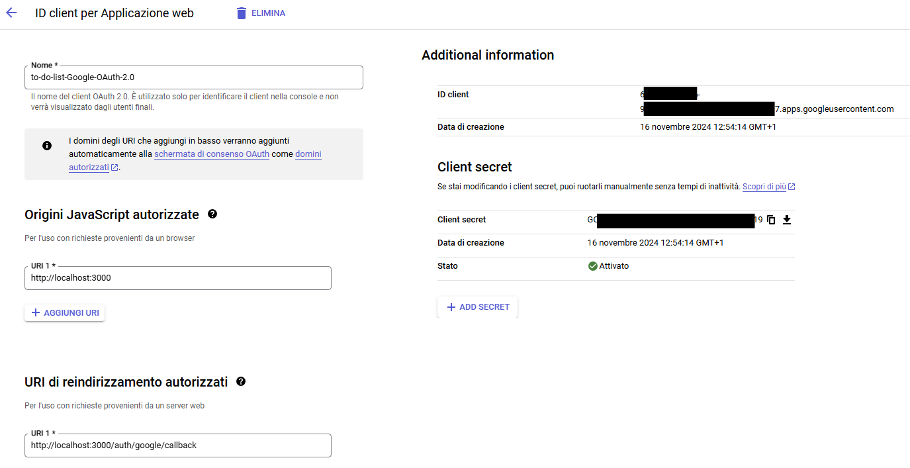

# TO-DO-LIST Google-OAuth-2.0
La seguente applicazione web permette di creare, scaricare e importare una lista con la possibilità di aggiungere o eliminare voci. I dati della lista non vengono salvati in un database, ma sono memorizzati nel localStorage del browser, risultando accessibili solo dallo stesso dispositivo e dallo stesso browser. Se l'utente cambia dispositivo, usa un altro browser o svuota la cache, la lista andrà persa.

Per accedere alla web app, è necessario autenticarsi tramite Google OAuth 2.0.
L'applicazione è sviluppata con Node.js e utilizza Passport.js per gestire il login federato con Google.

---

:spiral_notepad: **Flusso di Autenticazione con Google OAuth 2.0:**
1. L'utente clicca su "Login con Google".
2. Passport.js reindirizza l'utente al server di Google per l'autenticazione OAuth.
3. Google autentica l'utente e reindirizza al callbackURL con un authorization code.
4. Passport.js scambia il codice con un access token e un ID token.
5. Passport.js recupera il profilo dell'utente e lo salva nella sessione (o in un database, se configurato).
6. L'utente autenticato può ora accedere alle funzionalità dell'applicazione.

---

🧑‍💻 **Ambienti Utilizzati:**
- WSL Ubuntu.
- Visual Studio Code.

---

🛠️ **Tecnologie utilizzate:**
- Node.js: Ambiente runtime per l'esecuzione del codice JavaScript.
- Express.js:  Framework web per gestire le route e costruire API RESTful.
- Passport.js: Middleware di autenticazione che supporta diversi tipi di autenticazione come OAuth 2.0.
- Google OAuth 2.0 API: Protocollo per il login federato con Google come provider.
- Express-Session: Middleware per la gestione delle sessioni che ad ogni richiesta controlla la scadenza della sessione.

---

📂 **Struttura del progetto:**
```
to-do-list-google-oauth-2.0/
├── src/				  # per il codice sorgente
│   ├── app.js          # Configurazione Express
├── views/				# per i file HTML/EJS
│   ├── index.ejs       # Pagina principale
├── config/				# per i file di confguraazione
│   └── passport.js     # Configurazione Passport.js
├── .env                # Variabili d'ambiente
├── .gitignore          # File Git ignorati
├── package.json        # File di configurazione NPM
└── README.md           # Documentazione
```
---

📘 **Rotte principali:**
- GET /: Home page.
- GET /login: Pagina di login.
- GET /auth/google: Avvia l'autenticazione con Google.
- GET /auth/google/callback: Callback dopo l'autenticazione.
- GET /logout: Disconnette l'utente.

---

:gear: **Prerequisiti:**
- [Node.js](https://nodejs.org/) (v14 o successiva)
- [NPM](https://www.npmjs.com/)
- Un account su [Google Cloud Console](https://console.cloud.google.com/).

---

📦 **Installazione delle dipendenze:**
```
npm install
npm init -y
npm install express passport passport-google-oauth20 dotenv ejs
npm install express
npm install express-session
```
---

🔧 **Configurazione delle variabili d'ambiente**:  
In un file .env aggiungere le seguenti entry:
```
PORT=3000
GOOGLE_CLIENT_ID=<Il-tuo-Client-ID>
GOOGLE_CLIENT_SECRET=<Il-tuo-Client-Secret>
SESSION_SECRET=<Un-segreto-casuale>
```
---

📂 **File ignorati:** (.gitignore)
- node_modules/
- .env
- package.json
- package-lock.json

---

📜 **Creazione Account Google:**  
Operazioni principali:
- Creazione di un progetto su Google Cloud.
- Abilitazione dell'API.
- Generazione delle credenziali OAuth 2.0 (Client ID e Client Secret) per un applicazione web.
- Configurazione dei Redirect URI, includendo http://localhost:3000/auth/google/callback per l'ambiente di sviluppo.



---

:rocket: **Come avviare l'applicazione:**  
Da terminale, lanciare: **node src/app.js**

---

👮‍♂️ **Problemi di Sicurezza Rilevati e Soluzioni:**  

⚠️ **Problemi di Sicurezza:**
- **Man-in-the-Middle (MITM):** L'assenza di HTTPS espone le comunicazioni, inclusi i token OAuth, a potenziali intercettazioni.
- **Replay Attack:** OAuth 2.0, utilizzato da Passport.js, offre protezione contro attacchi di tipo replay grazie a token temporanei e autorizzazioni basate su scope. Tuttavia, senza gestione delle sessioni e revoca dei token, un token compromesso potrebbe essere riutilizzato.
- **Session Hijacking:** Senza una corretta configurazione dei cookie di sessione (HttpOnly, Secure, SameSite), questi possono essere vulnerabili a furti tramite XSS o intercettazioni di rete.

✅ **Soluzioni Implementate:**
- **Man-in-the-Middle:** Abilitato l'uso obbligatorio di HTTPS per proteggere le comunicazioni.
- **Replay Attack:** Implementata una durata breve per i token e revoca automatica dopo il logout.
- **Session Hijacking:** Configurati i cookie di sessione con i flag HttpOnly, Secure, SameSite e impostata una durata limitata per le sessioni.